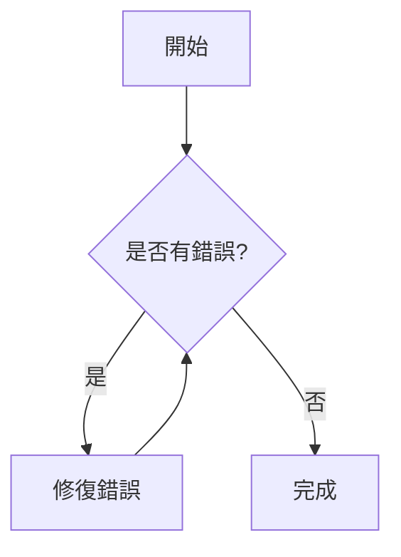
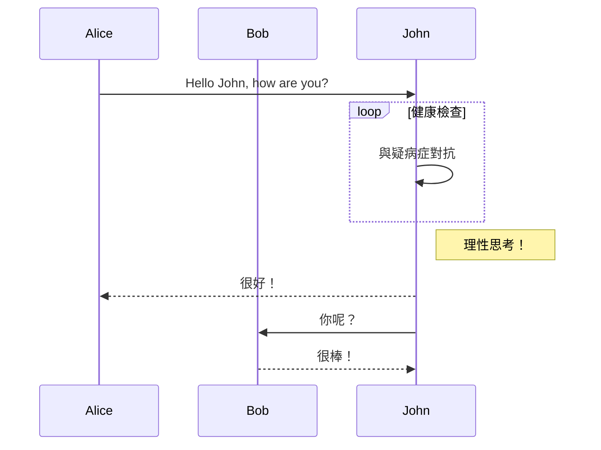
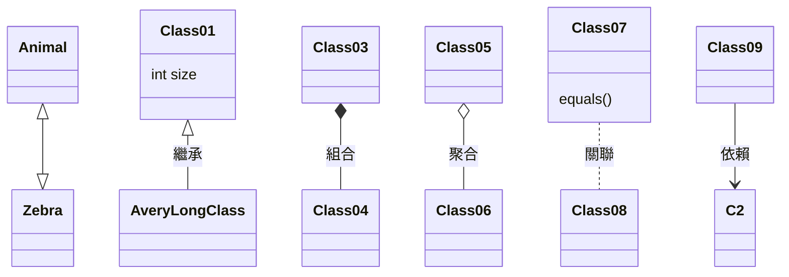
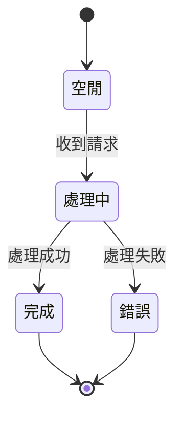
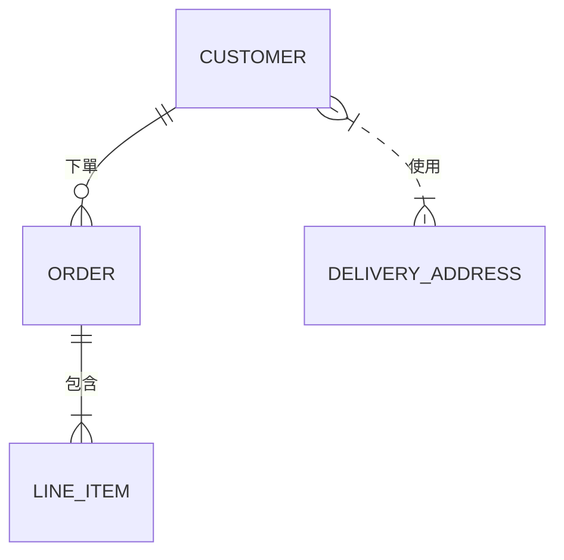

# 工程師必備的視覺化溝通技巧

Terry Lin @MediaTek

---
layout: center
class: text-center
---

# 解釋複雜架構時，是否常覺得<br/>「一張圖勝過千言萬語」，<br/>但畫圖又很花時間？

<style>
h1 {
  line-height: 3.5rem;
}
</style>

---
layout: center
class: text-center
---

# 在跨團隊會議或技術討論中，<br/>是否曾因大家對流程理解不一致，<br/>導致討論常常卡關？

<style>
h1 {
  line-height: 3.5rem;
}
</style>

---
layout: center
class: text-center
---

# 面對落落長的技術文件，<br/>很難快速掌握核心架構和流程？

<style>
h1 {
  line-height: 3.5rem;
}
</style>

---
layout: center
class: text-center
---


---
layout: center
class: text-left
---

# 視覺化溝通的價值

- 快速傳達複雜資訊
- 減少溝通誤解
- 提高會議和討論效率
- 增強文件可讀性

**善用<span v-mark.orange="1">視覺化工具</span>，正是解決痛點的關鍵！**

---
layout: center
---

# 三大視覺化工具

Mermaid、Excalidraw、Draw.io

---
layout: center
---

# Mermaid 是什麼？

- 用程式碼生成圖表的神器
- 支援流程圖、時序圖、類別圖等
- 純文字格式，易於版本控制
- 無需繪圖技巧，專注內容本身
- GitHub、Gitea、Notion、Obsidian 等工具原生支援

---

# FlowChart

<div class="grid grid-cols-2 place-items-center h-100">
<div>
```
flowchart TD
    A[開始] --> B{是否有錯誤?}
    B -->|是| C[修復錯誤]
    C --> B
    B -->|否| D[完成]
```
</div>
<div>

</div>
</div>

---

# Sequence Diagram

<div class="grid grid-cols-2 place-items-center h-100">
<div>
```
sequenceDiagram
    participant Alice
    participant Bob
    Alice->>John: Hello John, how are you?
    loop 健康檢查
        John->>John: 與疑病症對抗
    end
    Note right of John: 理性思考！
    John-->>Alice: 很好！
    John->>Bob: 你呢？
    Bob-->>John: 很棒！
```
</div>
<div>

</div>
</div>

---

# Class Diagram

<div class="grid grid-cols-2 place-items-center h-100">
<div>
```
classDiagram
    Animal <|--|> Zebra
    Class01 <|-- AveryLongClass : 繼承
    Class03 *-- Class04 : 組合
    Class05 o-- Class06 : 聚合
    Class07 .. Class08 : 關聯
    Class09 --> C2 : 依賴
    Class07 : equals()
    Class01 : int size
```
</div>
<div>

</div>
</div>

---

# State Diagram

<div class="grid grid-cols-2 place-items-center h-100">
<div>
```
stateDiagram-v2
    [*] --> 空閒
    空閒 --> 處理中 : 收到請求
    處理中 --> 完成 : 處理成功
    處理中 --> 錯誤 : 處理失敗
    完成 --> [*]
    錯誤 --> [*]
```
</div>
<div>

</div>
</div>

---

# ER Diagram

<div class="grid grid-cols-2 place-items-center h-100">
<div>
```
erDiagram
    CUSTOMER ||--o{ ORDER : 下單
    ORDER ||--|{ LINE_ITEM : 包含
    CUSTOMER }|..|{ DELIVERY_ADDRESS : 使用
```
</div>
<div>

</div>
</div>

---
layout: center
---

# Mermaid × AI：強強聯手

- Mermaid 是 AI 溝通的「正式語言」，每個流程、節點、決策點都明確定義
- 以流程圖形式表達，可消除傳統 Markdown、JSON、XML 容易產生的歧義
- 對 AI 而言，Mermaid 流程圖就像一張精確「地圖」，提升理解與生成品質
- 社群經驗：Claude 等 AI 對 Mermaid 支援極佳，遠勝傳統格式
- 工程師可請 AI 直接產生流程圖，再微調細節，高效、省時

---
layout: center
---

# Mermaid 使用方式

- 直接在 Markdown 文件中編寫
- 線上編輯器：[Mermaid Live Editor](https://mermaid.live/)
- VS Code 擴充：[Markdown Mermaid](https://marketplace.visualstudio.com/items?itemName=bierner.markdown-mermaid)
- 命令行工具：[mermaid-cli](https://github.com/mermaid-js/mermaid-cli)
- 支援導出 PNG、SVG 等格式

---
layout: center
---

# Excalidraw

- 手繪風格，直覺操作
- 適合腦力激盪、快速草圖、協作討論
- 支援即時協作、嵌入應用
- 網頁版：[excalidraw.com](https://excalidraw.com/)
- VS Code 擴充、React 元件

---
layout: center
---


---
layout: center
---

# Draw.io

- 專業圖表、模板豐富
- 適合正式文件、複雜架構
- 支援 UML、ER、網路圖等
- 網頁版：[diagrams.net](https://app.diagrams.net/)
- 桌面版、VS Code 擴充

---
layout: center
---


---
layout: center
---

# 工具選擇建議

| 工具        | 適合情境             |
| ----------- | -------------------- |
| Mermaid     | 技術文件、AI 溝通、流程標準化 |
| Excalidraw  | 腦力激盪、協作、快速草圖     |
| Draw.io     | 正式文件、複雜圖表         |

---
layout: center
class: text-left
---

# 總結

- 選擇合適工具，提升溝通效率
- **Mermaid + AI = 新世代工程師必備技能**
- 鼓勵大家動手試試 Mermaid！

---
layout: end
---

# 謝謝聆聽

[Slide Repo Link](https://github.com/terry623/visual-communication-introduction)
