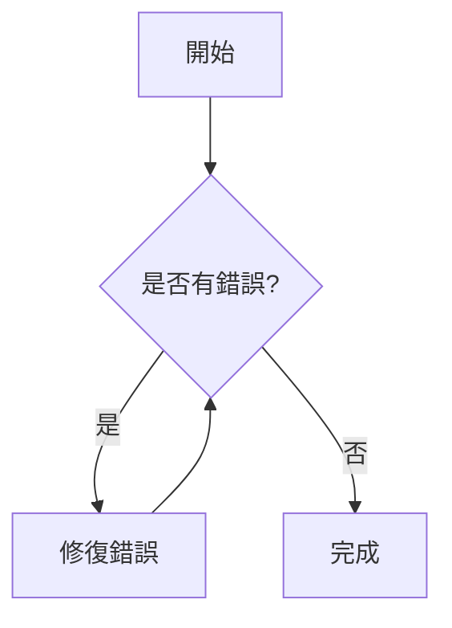
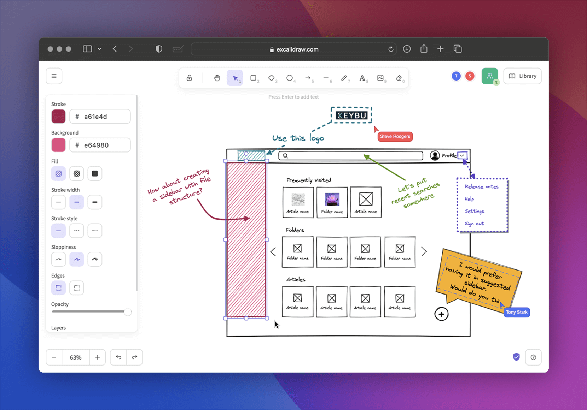
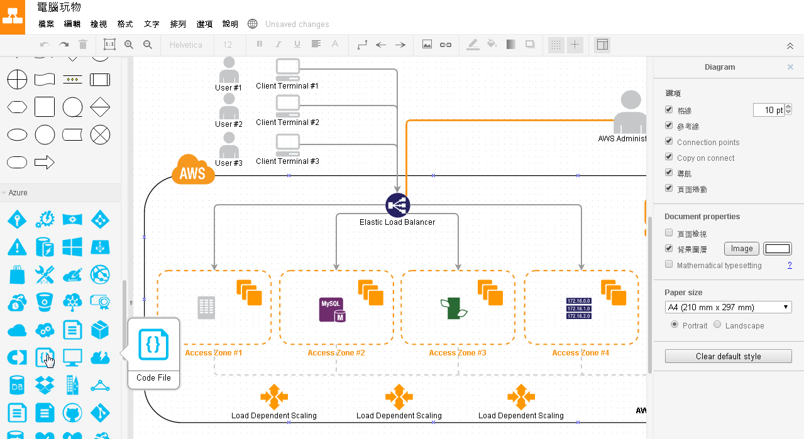

# 工程師必備的視覺化溝通技巧

Terry Lin @MediaTek

---
layout: center
class: text-center
---

# 解釋複雜架構時，是不是常覺得<br/>「一張圖勝過千言萬語」，<br/>但畫圖又很花時間？

---
layout: center
class: text-center
---

# 在跨團隊會議或技術討論中，<br/>是否曾因大家對流程理解不一致，<br/>導致討論常常卡關？

---
layout: center
class: text-center
---

# 面對落落長的技術文件，<br/>很難快速掌握核心架構和流程？

---
layout: center
class: text-center
---


---
layout: center
class: text-left
---

# 視覺化溝通的價值

- 快速傳達複雜資訊
- 減少溝通誤解
- 提高會議和討論效率
- 增強文件可讀性

**善用<span v-mark.orange="1">視覺化工具</span>，正是解決痛點的關鍵！**

---
layout: section
---

# 今日介紹三款實用工具

Mermaid、Excalidraw、Draw.io

---

# Mermaid

用程式碼生成圖表的神器

<div class="grid grid-cols-2 gap-4">
<div>

- 使用類 Markdown 語法
- 易於版本控制 (純文字)
- 無需繪圖技巧，專注於內容

</div>
<div>

- GitHub, Gitea 原生支援
- VS Code 預覽支援
- Notion, Obsidian 等工具支援

</div>
</div>

---
layout: center
---

<div class="grid grid-cols-2 gap-6 place-items-center">
<div>
```
graph TD
    A[開始] --> B{是否有錯誤?}
    B -->|是| C[修復錯誤]
    C --> B
    B -->|否| D[完成]
```
</div>
<div>

</div>
</div>

---

# Mermaid 適用情境

<div class="grid grid-cols-2 gap-4">
<div>

## 適合用於：

- 技術文件和 README
- 流程圖和決策樹
- 序列圖 (API 呼叫流程)
- 狀態圖
- 甘特圖 (專案時程)
- 類圖 (簡化的 UML)

</div>
<div>

## 使用方式：

- 直接在 Markdown 文件中編寫
- 線上編輯器：[Mermaid Live Editor](https://mermaid.live/)
- VS Code 擴充：[Markdown Mermaid](https://marketplace.visualstudio.com/items?itemName=bierner.markdown-mermaid)
- 命令行工具：[mermaid-cli](https://github.com/mermaid-js/mermaid-cli)
- 支援導出為 PNG, SVG 等格式

</div>
</div>

<style>
h2 {
  margin-bottom: 0.5rem;
}
</style>

---

# Excalidraw

直覺易用的手繪風格白板工具

<div class="grid grid-cols-2 gap-4">
<div>

- 手繪風格，視覺效果討喜
- 操作簡單直覺，容易上手
- 支援即時協作

</div>
<div>

- 輕量級，適合快速草圖
- 內建基本圖形和常用元素
- 可嵌入到其他應用中

</div>
</div>

---
layout: center
---



---

# Excalidraw 適用情境

<div class="grid grid-cols-2 gap-4">
<div>

## 適合用於：

- 腦力激盪和概念發想
- 團隊即時協作討論
- 簡單的流程說明
- 非正式的系統概述
- 簡易 UI 線框圖
- 會議記錄和視覺筆記

</div>
<div>

## 使用方式：

- 網頁版：[excalidraw.com](https://excalidraw.com/)
- VS Code 擴充：[Excalidraw Editor](https://marketplace.visualstudio.com/items?itemName=pomdtr.excalidraw-editor)
- React 元件：可嵌入到自己的應用
- 支援導出為 PNG, SVG 等格式
- 可分享協作連結

</div>
</div>

<style>
h2 {
  margin-bottom: 0.5rem;
}
</style>

---

# Draw.io

功能全面的專業繪圖工具

<div class="grid grid-cols-2 gap-4">
<div>

- 提供大量預設圖形和模板
- 支援多種圖表類型
  - UML、BPMN、網路圖
  - 系統架構圖、流程圖

</div>
<div>

  - ER 圖、思維導圖等
- 免費，可線上使用或安裝桌面版
- 支援多種儲存選項 (本地、雲端)

</div>
</div>

---
layout: center
---



---

# Draw.io 適用情境

<div class="grid grid-cols-2 gap-4">
<div>

## 適合用於：

- 正式的系統架構文件
- 複雜的流程圖和決策樹
- 詳細的 UML 圖表
- 資料庫 ER 圖
- 網路拓撲圖

</div>
<div>

## 使用方式：

- 網頁版：[diagrams.net](https://app.diagrams.net/)
- 桌面版：[下載頁面](https://github.com/jgraph/drawio-desktop/releases)
- VS Code 擴充：[Draw.io Integration](https://marketplace.visualstudio.com/items?itemName=hediet.vscode-drawio)
- 支援導出多種格式 (PNG, SVG, PDF...)

</div>
</div>

<style>
h2 {
  margin-bottom: 0.5rem;
}
</style>

---

# 工具選擇指南

<div class="grid grid-cols-3 gap-4">
<div>

## Mermaid

- 需要嵌入到 Markdown 中
- 重視版本控制和文件一致性
- 頻繁更新的流程或架構
- 標準化的圖表需求
- 技術文件和 README

</div>
<div>

## Excalidraw

- 需要快速草圖
- 進行腦力激盪
- 團隊即時協作
- 偏好輕鬆、討喜的視覺風格
- 簡單的概念說明

</div>
<div>

## Draw.io

- 需要專業、精確的圖表
- 有複雜的圖表需求
- 需要特定類型的圖表 (UML, ER)
- 需要詳細的系統文件

</div>
</div>

<style>
h2 {
  margin-bottom: 0.5rem;
}
</style>

---
layout: center
class: text-left
---

# 總結

<div class="grid grid-cols-1 gap-4">
<div>

## 選擇合適工具，提升溝通效率

<br />

- **Mermaid**: 程式碼化、版本控制、文件整合
- **Excalidraw**: 快速、直覺、協作
- **Draw.io**: 專業、全面、精確

<br />

</div>
</div>

## 馬上來動手試試看！

---
layout: end
---

# 謝謝聆聽

[Slide Repo Link](https://github.com/terry623/visual-communication-introduction)
